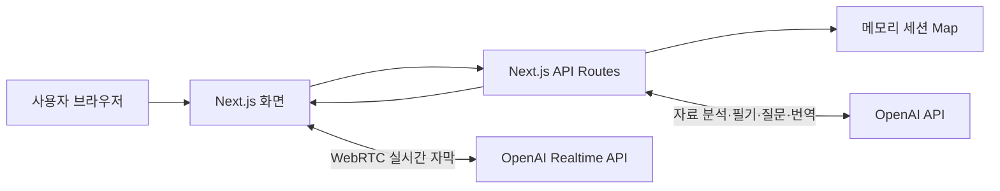

# LecturAI

실시간 강의를 듣고 자막, 누적 필기, 질문 답변, 번역, 복귀 요약을 한 화면에서 제공하는 AI 강의 보조 웹 애플리케이션입니다.

- 라이브 데모: [https://lecturai.34-50-33-243.sslip.io](https://lecturai.34-50-33-243.sslip.io)
- 프론트엔드와 백엔드는 하나의 Next.js 서버에서 실행됩니다.
- 별도의 Express 서버는 사용하지 않습니다. 백엔드 API는 `src/app/api/**/route.ts`에 있습니다.

## 주요 기능

- PDF 또는 PPTX 강의 자료 분석
- OpenAI Realtime WebRTC 기반 실시간 자막
- 확정 자막을 시간순으로 보존하는 Transcript Notebook
- 새 대본을 반영하는 2분 간격 자동 누적 필기
- 질문 시점까지의 강의 자료와 대본만 사용하는 강의 질문
- 대본 선택영역 빠른 설명과 별도의 상세 이해 분기
- 바로 해결하지 못한 질문을 맡겨 두고 나중에 다시 확인하는 보류 질문
- 자리 비움 구간 요약과 놓친 흐름 복구
- 한국어·영어 실시간 번역
- 명시적 종료 또는 비활동 감지 후 최종 필기와 Review Sheet 생성
- Raw Log와 상태 확인 API를 통한 데모 진단

웹 검색과 외부 사실 보충은 비활성화되어 있습니다. 답변은 현재 세션의 강의 자료, 대본, 필기를 근거로 생성됩니다.

## 기술 구성

| 구분 | 사용 기술 |
| --- | --- |
| 웹 프레임워크 | Next.js 16 App Router |
| UI | React 19, TypeScript |
| 데이터 검증 | Zod |
| AI | OpenAI API, OpenAI Agents SDK, OpenAI Realtime API |
| 자료 처리 | PDF.js, PDF/PPTX 분석 파이프라인 |
| 운영 배포 | Docker, Docker Compose, Caddy, Google Compute Engine |
| 상태 저장 | Node.js 프로세스 메모리 `Map` |

## 동작 구조



1. 강의 자료가 있으면 세션 생성 시 PDF/PPTX를 분석합니다.
2. 브라우저는 서버가 발급한 임시 토큰으로 OpenAI Realtime API에 직접 연결합니다.
3. 확정된 자막만 Next.js API 서버에 저장합니다.
4. 첫 확정 자막부터 120초 간격으로 새 대본을 누적 필기에 반영합니다.
5. 질문과 선택영역 설명은 요청 시점의 대본 경계를 고정해 이후 발화를 섞지 않습니다.
6. 수업이 끝나면 남은 대본을 반영한 최종 필기와 Review Sheet를 만듭니다.

자동 필기 주기는 현재 코드에서 120초로 고정되어 있습니다. 수동 필기 생성 버튼과 자동 필기 끄기 기능은 제공하지 않습니다.

## 로컬 실행

### 요구사항

- Node.js 20 이상
- npm
- OpenAI API 키

### 설치 및 시작

```bash
git clone https://github.com/yuupmu/LecturAI.git
cd LecturAI
npm install
cp .env.example .env.local
```

`.env.local`에서 `OPENAI_API_KEY`를 설정합니다.

```dotenv
OPENAI_API_KEY=sk-...
OPENAI_FAST_MODEL=gpt-4.1-nano
OPENAI_SMART_MODEL=gpt-4.1-nano
OPENAI_FINAL_NOTE_MODEL=gpt-4.1-nano
OPENAI_MATERIAL_MODEL=gpt-4.1-nano
OPENAI_TRANSLATION_MODEL=gpt-4.1-nano
LECTURE_ENDING_GRACE_SECONDS=10
LECTURE_INACTIVITY_SECONDS=600
LECTURE_INACTIVITY_GRACE_SECONDS=30
NEXT_PUBLIC_ENABLE_DEMO_CONTROLS=false
```

```bash
npm run dev
```

- 화면: [http://localhost:3000](http://localhost:3000)
- 상태 확인: [http://localhost:3000/api/health](http://localhost:3000/api/health)

환경변수를 바꾸면 개발 서버를 다시 시작해야 합니다. `.env.local`은 Git에 커밋하지 않습니다.

마이크는 브라우저 권한이 필요합니다. 로컬 개발에서는 `localhost`를 사용할 수 있고, 외부 공개 주소에서는 HTTPS가 필요합니다.

## 기본 사용 흐름

1. 강의 자료를 선택하거나 자료 없이 세션을 시작합니다.
2. 마이크 권한을 허용하고 실시간 자막을 시작합니다.
3. 확정 자막과 2분 자동 필기를 확인합니다.
4. 질문창을 사용하거나 대본을 드래그해 빠른 설명 또는 상세 이해를 요청합니다.
5. 필요하면 번역, 자리 비움, 놓친 흐름 복구, 보류 질문 기능을 사용합니다.
6. 수업 종료가 감지되면 계속 듣거나 최종 정리를 진행합니다.

개발자용 데모 입력은 `.env.local`의 `NEXT_PUBLIC_ENABLE_DEMO_CONTROLS=true` 또는 URL의 `?debug=1`로 활성화할 수 있습니다.

## 프로젝트 구조

```text
src/
├── app/
│   ├── api/                 # Next.js 백엔드 API
│   ├── page.tsx             # 메인 화면
│   └── raw/[sessionId]/     # Raw Log 화면
├── backend/
│   ├── lecture/             # 필기·질문·부재·이해 분기 파이프라인
│   ├── presentation/        # PDF/PPTX 분석
│   ├── realtime/            # OpenAI Realtime 임시 토큰
│   ├── translation/         # 실시간 번역
│   └── session-store.ts     # 메모리 세션 저장소
├── components/lecturai/     # 강의 UI 컴포넌트
└── frontend/                # 화면 상태와 API 클라이언트

deploy/                      # Google Cloud VM 배포 스크립트와 Caddy 설정
scripts/                     # 회귀 테스트와 데모 스모크 테스트
compose.yaml                 # Next.js + Caddy 운영 구성
Dockerfile                   # Next.js standalone 이미지
```

## API 요약

| 메서드 | 경로 | 용도 |
| --- | --- | --- |
| `GET` | `/api/health` | 서버 상태 확인 |
| `POST` | `/api/session` | 강의 세션 생성과 자료 분석 |
| `POST` | `/api/realtime/token` | Realtime API 임시 토큰 발급 |
| `POST` | `/api/session/:id/transcript` | 확정 자막 저장 |
| `GET` | `/api/session/:id/state` | 전체 세션 상태 조회 |
| `PATCH` | `/api/session/:id/translation` | 번역 설정 변경 |
| `POST` | `/api/session/:id/assistant` | 일반 질문 또는 선택영역 설명 요청 |
| `GET, POST` | `/api/session/:id/questions` | 강의 질문 조회·생성 |
| `POST` | `/api/session/:id/understanding/branches` | 상세 이해 분기 시작 |
| `POST` | `/api/session/:id/deferred-questions` | 보류 질문 생성 |
| `GET, POST` | `/api/session/:id/absence/*` | 자리 비움 시작·종료·조회 |
| `POST` | `/api/session/:id/missed-flow` | 놓친 흐름 복구 요청 |
| `POST` | `/api/session/:id/end/cancel` | 종료 후보 취소 |
| `GET` | `/api/session/:id/raw` | Raw Log 조회 |
| `POST` | `/api/session/:id/reset` | 세션 내용 초기화 |

세션 생성 예시:

```bash
curl -X POST http://localhost:3000/api/session \
  -F 'material=@./slides.pdf;type=application/pdf' \
  -F 'instruction=강의 핵심을 구조화해서 정리하세요.' \
  -F 'language=ko'
```

`material`은 선택 사항이며 PDF와 PPTX를 지원합니다.

## 검증

```bash
npm run typecheck
npm run lint
npm test
npm run build
```

실제 개발 서버와 API 키를 사용하는 데모 스모크 테스트:

```bash
npm run demo:smoke
```

## Google Cloud 단일 VM 배포

현재 데모 배포 구조는 다음과 같습니다.

```text
사용자 → HTTPS/Caddy → Next.js:3000 → OpenAI API
```

- `deploy/create-gcp-vm.sh`: 서울 리전 VM, 고정 IP, 웹 방화벽 생성
- `deploy/setup-ubuntu-vm.sh`: Ubuntu에 Docker를 설치하고 앱 환경변수와 HTTPS 구성
- `compose.yaml`: Next.js 앱 한 개와 Caddy 한 개 실행
- `deploy/Caddyfile`: HTTPS 인증서, 압축, 100MB 요청 제한, 리버스 프록시

서버 환경변수는 저장소 밖에 보관합니다.

```text
/etc/lecturai/app.env
/etc/lecturai/caddy.env
```

운영 컨테이너 확인:

```bash
sudo docker compose -f /opt/lecturai/compose.yaml ps
curl https://YOUR_SITE/api/health
```

GitHub 병합만으로 실행 중인 Google Cloud 서버가 자동 갱신되지는 않습니다. 실제 사이트 반영에는 서버에서 별도 재배포가 필요합니다.

## 현재 제약

- 세션은 `src/backend/session-store.ts`의 메모리 `Map`에 저장됩니다.
- 서버나 컨테이너를 재시작하면 진행 중인 강의 세션이 사라집니다.
- 여러 앱 인스턴스를 실행하면 인스턴스마다 세션 상태가 달라질 수 있습니다.
- 로그인과 사용자별 데이터 분리는 아직 없습니다.
- 업로드 파일과 강의 결과를 영구 저장하지 않습니다.
- 공개 사이트에서는 OpenAI API 사용량과 비용을 별도로 모니터링해야 합니다.

실서비스로 확장하려면 PostgreSQL, Redis, 객체 스토리지, 작업 큐, 사용자 인증을 추가하는 것이 필요합니다.
